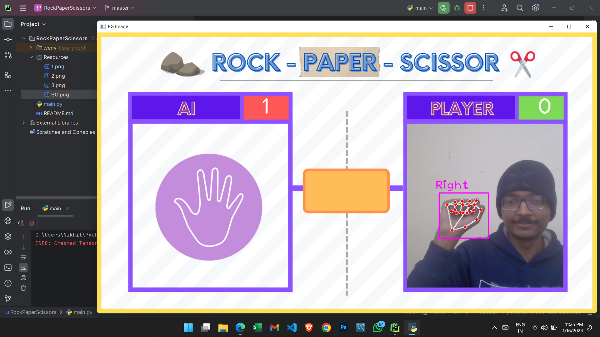
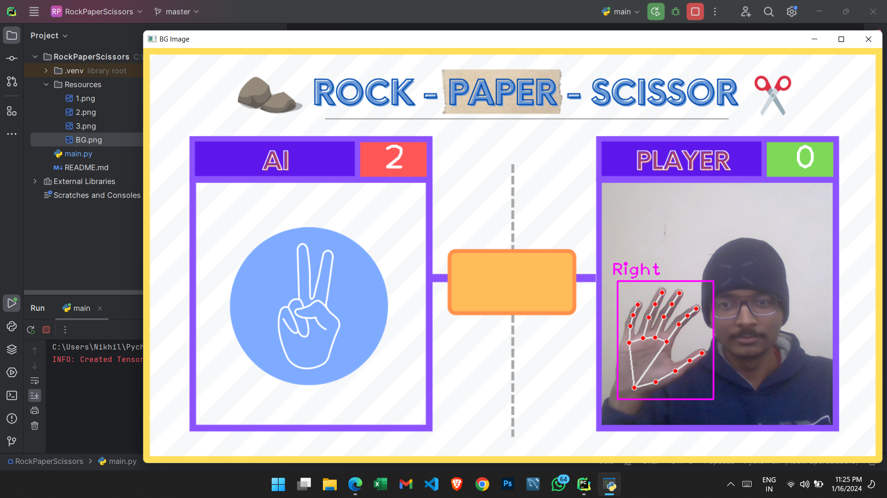

# Rock-Paper-Scissors Game with Hand Detection

## Description

This project is a simple Rock-Paper-Scissors game that uses hand detection to interpret the player's move in real-time. The game includes an AI opponent, and the player competes against the AI with hand gestures representing rock, paper, or scissors.

## Features

- Hand detection using OpenCV and the cvzone library.
- Real-time interaction with the camera to capture the player's hand gestures.
- AI opponent with randomly generated moves.
- Game timer for each round.
- Score tracking to keep a record of player vs AI wins.

## Installation

1. Clone My Repo to Your local machine:
2. Install the libraries

      ```bash
   pip install opencv-python
   pip install cvzone
   pip install mediapipe

3. Run the Game:

      ```bash
   python rock_paper_scissors.py

## Usage

1. Launch the game by running the script.
2. Press 's' to start the game and begin hand detection.
3. Show your hand gesture to the camera, and the AI will generate a random move.
4. The result will be displayed on the screen, and the score will be updated accordingly.
5. Press 'q' to quit the game.
6. Press 'r' to restart the game.

## SnapShots of Game:





